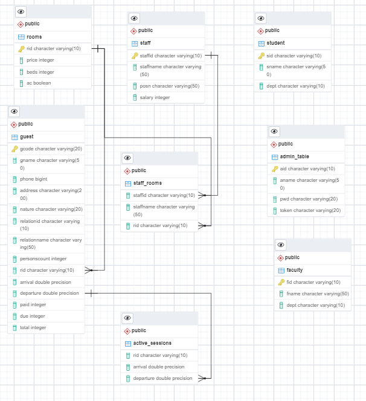

# Welcome to GUEST-ROOM-MANAGEMENT
A project for RDBMS Lab 4th sem in 2021.

Dated: 23.03.2021

This project is brought to you by **[Gayathri MS](https://github.com/gayathri-ms)**, 
**[Manas Sahu](https://github.com/Zangetsu112)** and **[Atrik Ray](https://github.com/AtrikGit6174)**.
We are 2nd year CSE students in IIIT Bhubaneswar.

The project intends to provide a solution to implement the IIIT Guest House Management System, 
using a database and web pages to interact with the database. This project has been done for our 4th Sem RDBMS Lab. 
It has been built in accordance with how our Guest House actuallyoperates, and is less diverse and dynamic than a 
real guest house. Thus, the project has scope for being implemented for a public guest house not related to any 
institute after certain modifications. Many such tables and related sequences and trigger can be found in the comments 
of the files in the [database directory](https://github.com/gayathri-ms/guest-room-management/tree/main/database).

* [GitHub Repo](https://github.com/gayathri-ms/guest-room-management/)
* [GitHub Pages](https://gayathri-ms.github.io/guest-room-management/)

### SOFTWARE USED
For Database

1. PostgreSQL 10.15
2. pgAdmin 4.30

For Front-end and Back-end

3. Bottle Micro Framework (API endpoints/ Back end)
4. React (Front end)

### DEVELOPMENT PLATFORM
* Operating System: Windows 10 and Mac
* Browser used: Google Chrome 89.0.4389.82

### SUPPORTED PLATFORMS
Since it is a local server based project, it can be implemented on any browsers supporting HTML5 and CSS3,
while Python 3.7, PostgreSQL 10.15 and pgAdmin 4.30 require Windows 10 and are not supported on lower 
versions of Windows.

### REPOSITORY DETAILS
The database contains:
1. [Backend directory](https://github.com/gayathri-ms/guest-room-management/tree/main/new_backend) 

    This contains files relating to the backend of the project. 
    
2. [Database directory](https://github.com/gayathri-ms/guest-room-management/tree/main/database)

    This contains the schema and the corresponding sequences and trigger to create the required database.
    Also contains sample data and the ERD.
   
3. [Frontend directory](https://github.com/gayathri-ms/guest-room-management/tree/main/src)
    
    This contains the Fronteend code and the sitemap.PNG
    
4. [images](https://github.com/gayathri-ms/guest-room-management/tree/main/images)
    
    This contains images of the webpages.
    
### DOWNLOAD AND SETUP
* Step 1. Create a database in your local system using pgAdmin 4.30 or psql shell.
* Step 2: Open [new_backend/database.py](https://github.com/gayathri-ms/guest-room-management/tree/main/new_backend/database.py). In the db_connect() function, change the values of the 
attributes to match the database you created in step 1.
* Step 3: Open [database/schema.sql](https://github.com/gayathri-ms/guest-room-management/tree/main/database/schema.sql) and run in pgAdmin 4.30 under the database you created or 
using psql shell to create the database schema in your database. After that, run the sequences in 
[database/sequence.sql](https://github.com/gayathri-ms/guest-room-management/tree/main/database/sequence.sql) and triggers in [database/trigger.sql](https://github.com/gayathri-ms/guest-room-management/tree/main/database/trigger.sql) under the created 
database. Make sure to follow the comments for guidelines in the files. This completes setting the database up.
* Step 4: (Optional) The user can add a few required data on their own in the tables using psql or pgAdmin 4.30.
* Step 5: Run Python 3 in your computer shell. Under that, open [new_backend/server.py](https://github.com/gayathri-ms/guest-room-management/tree/main/new_backend/server.py) using the appropriate 
commands. This connects the backend to the database.

### SOFTWARE INTERFACE AND SAMPLE OPERATION

### SYSTEM DESIGN
#### Input Design
Input from the user will be taken using interactive forms built on web pages, using strings, options 
and drop-down menus. 

#### Processing Input
Input will be processed using checks in the database and the backend. If input is invalid, it is rejected 
and not feeded into the database or queries out of the database.

#### Output Design

#### Database Design

The ER Diagram has been generated using the “Generate ERD” beta feature of pgAdmin 4.30. It is a rough indicator of the 
relationships between the tables. However, for a complete knowledge of the schema, it is best to look at the schema,
[schema.sql](https://github.com/gayathri-ms/guest-room-management/tree/main/database/schema.sql) 

For developers: It is important to first execute the 
[sequence.sql](https://github.com/gayathri-ms/guest-room-management/tree/main/database/sequence.sql) and the 
[trigger.sql](https://github.com/gayathri-ms/guest-room-management/tree/main/database/trigger.sql) before taking in data 
from the front end as they have been used to generate unique primary key codes for each table in the schema.

### SYSTEM IMPLEMENTATION
The system is intended to be used by a previously trained user. The setup part requires a knowledge of using Command Line 
Interfaces to run a few files and link them. This is because the project is local server based. It has the scope to be expanded 
and deployed as a web application. Further, it has been developed keeping in mind the requirements of the IIIT Guest House, and 
needs little modifications to work for any general guest house management system.

### ACKNOWLEDGEMENTS
1. _Mr Raghunath Dey_, our instructor in the RDBMS Lab for assigning the project.
2. _[Gayathri MS](https://github.com/gayathri-ms)_, for learning and handling the front-end at very short notice.
3. _[Manas Sahu](https://github.com/Zangetsu112)_, for guiding the database outline in accordance with the backend.
4. _Atrik Ray_, for handling the database schema, data and documentation.
    * [LinkedIn - atrikray7171](https://www.linkedin.com/in/atrikray7171/)
    * [GitHub - AtrikGit6174](https://github.com/AtrikGit6174)
5. _YOU_, the reader, for your time and patience and interest!
